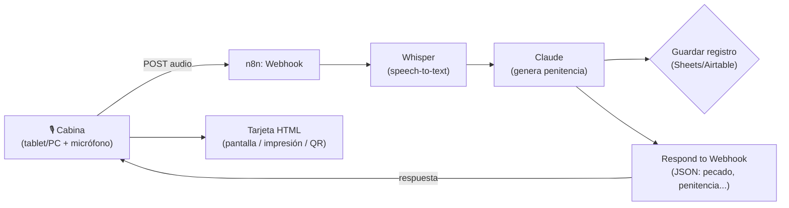

# Confesionario Ambiental IA

Dinámica de activación: la persona entra a la cabina, "confiesa" en voz alta un pecado
ambiental (ej. "dejo el aire acondicionado toda la noche"), un sistema escucha, y una
IA responde con una **penitencia realista** (ej. "no uses el AC después de las 10pm
durante 2 semanas"). Este documento explica las opciones y deja armado un MVP
funcional con n8n + una página web para la cabina.

## 1. Piezas del sistema

1. **Captura de audio** — algo físico en tu cabina que grabe y envíe el audio.
2. **n8n** — recibe el audio, lo transcribe, se lo pasa a la IA con instrucciones
   claras, y devuelve un JSON con el "pecado" resumido y la "penitencia".
3. **Tarjeta / entrega** — cómo la persona ve o se lleva su penitencia.

## 2. Opciones de captura de audio (la parte física)

| Opción | Costo/complejidad | Cómo funciona | Recomendado si... |
|---|---|---|---|
| **Tablet/PC con página web** (incluida en este repo, `booth/index.html`) | Bajo | El navegador graba con la API `MediaRecorder` y sube el audio al webhook de n8n | Ya tienes una tablet o laptop barata — **es el camino más rápido para un MVP** |
| Raspberry Pi + botón físico + micrófono USB | Medio | Un script en Python graba al presionar el botón y hace el POST HTTP | Quieres una experiencia más "objeto físico" sin pantalla visible |
| Grabadora dedicada (Zoom H1, etc.) + subida manual | Bajo costo, alto esfuerzo humano | Alguien del staff sube el archivo manualmente a un formulario que dispara n8n | Es un evento pequeño y puntual, sin afán de automatizar del todo |
| ESP32 + módulo de audio | Alto (requiere firmware) | Igual que Raspberry Pi pero más barato y más frágil de programar | Ya tienes experiencia en electrónica embebida |

**Recomendación:** empieza con la tablet/PC. Es lo que dejé construido en
[`booth/index.html`](booth/index.html) — no necesitas montar hardware nuevo, solo
poner una tablet o laptop dentro de la cabina con el navegador abierto en pantalla
completa.

## 3. Estado actual — ya está creado en tu n8n

El workflow **"Confesionario Ambiental IA"** ya está creado directamente en tu instancia
(vía el conector MCP de n8n), como borrador sin activar:

- Workflow: <https://kim-carbonbox.app.n8n.cloud/workflow/JBFZrMrHk0CcvfhI>
- Credenciales asignadas automáticamente: `n8n free OpenAI API credits` (Whisper) y
  `KIMSA` (Claude/Anthropic) — ambas ya existían en tu cuenta.
- Nodos: `Recibir confesión` (Webhook) → `Transcribir confesión (Whisper)` →
  `Generar penitencia (Padre Carbono)` (Claude) → `Parsear JSON de la IA` (Code) →
  `Responder a la cabina` (Respond to Webhook).

**Para probarlo ahora** (el workflow está inactivo, así que usa la URL de test):
1. Abre el workflow en el link de arriba.
2. Pulsa "Execute workflow" (o "Listen for test event" en el nodo Webhook) para que
   quede escuchando una ejecución de prueba.
3. Manda un audio de prueba a `https://kim-carbonbox.app.n8n.cloud/webhook-test/confesion`
   (campo `audio`, `multipart/form-data`) — por ejemplo pegando esa URL en el ⚙️ de
   [`booth/index.html`](booth/index.html) y grabando una confesión de prueba.
4. Revisa en n8n que cada nodo haya corrido bien y que la respuesta tenga
   `pecado`, `categoria`, `penitencia`, `dificultad` y `mensaje`.

**Cuando quieras dejarlo en producción para el evento:** dime "actívalo" y lo publico
(`publish_workflow`) — a partir de ahí la URL pasa a ser
`https://kim-carbonbox.app.n8n.cloud/webhook/confesion` (sin `-test`) y queda escuchando
sola, sin que tengas que abrir n8n cada vez.

## 3.1 El flujo de n8n (referencia / cómo está armado)

Está en [`n8n/workflow-confesionario.json`](n8n/workflow-confesionario.json), listo
para importar (`Import from File` en n8n). Nodos:

1. **Webhook** (`POST /confesion`) — recibe el audio como `multipart/form-data`,
   campo `audio`.
2. **Transcribir (Whisper)** — `HTTP Request` a la API de OpenAI
   (`/v1/audio/transcriptions`) con el binario del audio.
3. **Generar penitencia (Claude)** — `HTTP Request` a la API de Anthropic
   (`/v1/messages`) con el texto transcrito. El prompt de sistema le pide a Claude
   que actúe como "el Padre Carbono" y devuelva **solo JSON** con:
   - `pecado` — resumen corto del pecado, en tono de confesionario
   - `categoria` — movilidad / energia / consumo / alimentacion / residuos / agua / otro
   - `penitencia` — acción concreta, medible y realista, con plazo
   - `dificultad` — baja / media / alta
   - `mensaje` — cierre motivador y con humor
4. **Parsear JSON** (`Code`) — limpia la respuesta (por si Claude la envuelve en
   \`\`\`json) y la convierte en objeto.
5. **Registrar confesión** (`Google Sheets`, opcional/desactivado por defecto) —
   guarda cada confesión para armar estadísticas del evento ("100 personas dejaron
   de tomar 340 vuelos", etc.).
6. **Responder** (`Respond to Webhook`) — devuelve el JSON al navegador de la
   cabina, que arma la tarjeta visualmente (el diseño vive en el HTML, no en n8n).

### Credenciales que necesitas en n8n

- Una API key de OpenAI (para Whisper) — nodo `HTTP Request` con auth tipo
  `Header Auth`, header `Authorization: Bearer sk-...`.
- Una API key de Anthropic — header `x-api-key` + `anthropic-version: 2023-06-01`.
- (Opcional) credencial de Google Sheets si quieres el registro de confesiones.

> Nota: exporté el workflow con la estructura de nodos y el prompt ya escritos,
> pero **tendrás que revisar los nombres de credenciales** al importarlo — n8n no
> puede traer tus API keys en el archivo JSON (son secretas), así que te pedirá
> que las asocies la primera vez.

## 4. La tarjeta / cómo se la lleva la persona

El JSON que devuelve n8n se renderiza como una tarjeta tipo "boleta de penitencia"
directamente en `booth/index.html` (mismo archivo que grabó el audio). A partir de
ahí tienes varias formas de entregarla, de más simple a más elaborada:

| Entrega | Qué necesitas |
|---|---|
| **Se muestra en pantalla** (ya incluido) | Nada extra — la persona la lee/fotografía en la tablet |
| **Código QR a una página personal** | Guardar la confesión con un ID y servir `card.html?id=...` |
| **Impresión tipo ticket** | Impresora térmica ESC/POS + un pequeño script (Node/Python) que la dispare cuando llega la respuesta de n8n |
| **WhatsApp/Email** | Nodo de Twilio/WhatsApp Business o Gmail en n8n, si la persona deja su contacto |

Para el evento, lo más simple y con más impacto visual suele ser **pantalla +
opción de foto** (la gente saca su celular y fotografía su "penitencia"), sin
necesitar impresora ni pedir datos de contacto.

## 5. Prueba rápida sin n8n

Abrí [`booth/index.html`](booth/index.html) directo en un navegador: si no hay un
webhook configurado (o falla la conexión), entra en **modo demo** y genera una
penitencia de ejemplo localmente, así puedes ver y ajustar el diseño de la tarjeta
antes de conectar el backend real.

## 6. Guardar la penitencia (QR + correo)

Cuando la confesión es válida, la cabina ahora muestra un **código QR** y un campo de
**correo** para que la persona se lleve su tarjeta:

- Al generar la penitencia, n8n crea un `id` corto, guarda la confesión en la **Data
  Table** `confesiones_carbonbox`, y agrega un `cardUrl` a la respuesta
  (`.../webhook/confesion-card?id=...`).
- La cabina arma el QR con ese `cardUrl` (usando `api.qrserver.com`, sin librerías
  extra) y lo muestra bajo la tarjeta.
- Esa URL abre una página HTML (rama nueva del mismo workflow, `GET /confesion-card`)
  con la tarjeta ya armada y un botón **"Descargar imagen"** que usa `html2canvas`
  para guardar la tarjeta como PNG directamente en el celular de la persona — sin
  necesitar un servicio externo de renderizado de imágenes.
- Si alguien no puede escanear, puede escribir su correo: la cabina llama a
  `POST /webhook/confesion-email` (`{ id, email }`), que busca la confesión en la
  Data Table y la envía por Gmail (credencial `Gmail CarbonBox`) con el enlace a su
  tarjeta.

Todo esto vive en el mismo workflow de n8n (mismo link de antes), como ramas nuevas
del árbol: `Es pecado ambiental` (IF) → genera ID → guarda en Data Table → arma
`cardUrl`; y dos webhooks nuevos (`confesion-card`, `confesion-email`) independientes
del flujo de audio.

El correo que llega por `confesion-email` usa una plantilla con la identidad de marca
(fondo blanco, franja superior azul `#1620A4`, botón verde `#2F6B4A`) en vez de texto
plano — está en el parámetro `message` del nodo `Enviar correo`.

> **Nota sobre `n8n/workflow-confesionario.json`:** es un export de referencia del
> workflow tal como quedó configurado. Al importarlo en otra instancia de n8n deberás:
> 1. Reemplazar `https://TU-N8N.app.n8n.cloud` por el dominio real (aparece en
>    `Agregar URL de tarjeta` y en `Enviar correo`).
> 2. Volver a crear la Data Table `confesiones_carbonbox` (columnas: `confessionId`,
>    `pecado`, `categoria`, `penitencia`, `dificultad`, `mensaje`, `email` — todas texto).
> 3. Reasignar las credenciales de OpenAI, Anthropic y Gmail (por seguridad, los exports
>    de n8n nunca incluyen las credenciales reales, solo su nombre).

## 7. Siguientes pasos sugeridos

1. Decidir el proveedor de speech-to-text (Whisper vía OpenAI es el más simple;
   también existen AssemblyAI, Deepgram, Google Speech-to-Text).
2. Armar la cuenta de n8n (cloud o self-hosted) y las credenciales de OpenAI/Anthropic.
3. Importar el workflow, probarlo con un audio de prueba (Postman/curl) antes de
   conectar la tablet.
4. Ajustar el prompt de la penitencia según el tono que quieras (más serio, más
   cómico, más estricto en el nivel de exigencia).
5. Decidir si quieres registrar confesiones para mostrar un "impacto colectivo"
   en pantalla al final del evento (total de vuelos evitados, kg de residuos, etc.).
